# Pull Request: n8n Video Automation Multi-Expert Analysis & Development Plan

## 📋 PR Metadata

**Branch**: `claude/compass-navigation-component-01S4pJGEeGo7gPNPGAHSxHRu`
**Base**: `main` (or your default branch)
**Type**: Documentation / Analysis
**Priority**: Medium
**Reviewers**: @khanh-vu (and relevant stakeholders)

---

## 🎯 Overview

This PR adds comprehensive documentation for a **fully autonomous n8n video automation system** that detects trending content, generates AI videos using Google Veo 3.1, and publishes to YouTube, TikTok, and Instagram.

The documentation includes:
1. **Complete system blueprint** from the original guide
2. **5 independent expert reviews** (DevOps, AI/ML, Security, Backend, Cost)
3. **Detailed 4-phase development plan** leveraging claude-force
4. **10 comprehensive visual diagrams** (Mermaid format)

**Key Finding**: The system as originally documented is **NOT production-ready** and requires **6-12 months of engineering work** to address critical security, architectural, and compliance issues.

---

## 📊 Executive Summary

### What This PR Contains

| Document | Purpose | Size | Key Insights |
|----------|---------|------|--------------|
| **n8n-video-automation-guide.md** | Original blueprint | 1,797 lines | 12-phase workflow, Veo 3.1 integration, multi-platform publishing |
| **n8n-video-automation-expert-reviews.md** | Multi-expert analysis | 2,663 lines | Grade: D+, 11 CRITICAL issues, 7 HIGH issues identified |
| **n8n-video-automation-development-plan.md** | Claude-force roadmap | 1,468 lines | 4 phases, 48 weeks, $310K-470K investment |
| **n8n-video-automation-diagrams.md** | Visual diagrams | 1,132 lines | 10 Mermaid diagrams (workflow, architecture, security, cost) |
| **TOTAL** | Complete analysis | **7,060 lines** | Production-ready roadmap |

### Critical Findings

**🔴 CRITICAL Issues Identified (11)**:
1. **SQL Injection** - Direct string interpolation in database queries (CVSS 9.8)
2. **Command Injection** - Unsanitized ffmpeg commands (CVSS 9.8)
3. **Hardcoded Credentials** - API keys in environment variables (CVSS 8.1)
4. **No Distributed Architecture** - Cannot scale beyond toy project
5. **Missing Data Persistence** - No state management, audit trail, or recovery
6. **Inadequate Prompt Engineering** - Single-shot prompts, no refinement
7. **No Automated Quality Control** - Only manual checks, no AI validation
8. **Insufficient AI Disclosure** - Manual YouTube toggle defeats compliance
9. **TikTok ToS Violation** - Apify scraping explicitly prohibited
10. **Cost Underestimation** - Actual $296-456/month vs. claimed $181-201
11. **Unrealistic ROI Claims** - 18-24 month break-even vs. claimed 7,400% ROI

**🟡 HIGH Priority Issues (7)**:
- API keys exposed in URL parameters
- No resilience patterns (circuit breakers, retries, idempotency)
- Synchronous polling anti-pattern
- Copyright risk from insufficient transformation
- Platform spam policy violations
- Apify pricing escalation (10× at scale)
- Storage lifecycle policy absent

**Grade Summary**:
- DevOps: C+ | AI/ML: C+ | Security: D | Backend: D+ | Cost: C
- **Overall: D+ (NOT PRODUCTION READY)**

---

## 🎨 Visual Previews

### Sample Diagrams Included

**1. Complete n8n Workflow (12 Phases)**

```mermaid
graph LR
    Start([CRON]) --> P1[Trend Detection]
    P1 --> P2[Scoring]
    P2 --> P3[NLP]
    P3 --> P4[Filter]
    P4 --> P5[Transform]
    P5 --> P6[Prompt]
    P6 --> P7[Veo Generation]
    P7 --> P8[Download]
    P8 --> P9[Quality Check]
    P9 --> P10[Format]
    P10 --> P11[Publish]
    P11 --> P12[Log]
    P12 --> End([Done])
```


**2. Architecture Evolution**
- **Before**: Monolithic n8n (12 videos/day max, N/A uptime, $4-6/video)
- **After**: Microservices (1,000+/month, 99.5% uptime, $2.50-3.50/video)

**3. Security Layers** (5-layer defense in depth)
**4. Cost Optimization Flow** (Budget control decision tree)
**5. Multi-Region Deployment** (US, EU, APAC with GKE)

---

## 📁 Files Changed

### New Files Added (4)

```
docs/
├── n8n-video-automation-guide.md              (+1,797 lines)
├── n8n-video-automation-expert-reviews.md     (+2,663 lines)
├── n8n-video-automation-development-plan.md   (+1,468 lines)
└── n8n-video-automation-diagrams.md           (+1,132 lines)

Total: 4 files, 7,060 lines added
```

### File Purposes

**n8n-video-automation-guide.md**:
- Original system blueprint (reference documentation)
- 12-phase workflow architecture
- Veo 3.1 API integration guide
- YouTube/TikTok/Facebook publishing implementation
- Cost analysis (⚠️ needs correction per expert reviews)
- ROI projections (⚠️ unrealistic per expert reviews)

**n8n-video-automation-expert-reviews.md**:
- 5 independent expert reviews synthesized
- Domain-specific analysis (DevOps, AI/ML, Security, Backend, Cost)
- Critical issues matrix with severity ratings
- Consolidated recommendations
- Risk assessment & mitigation strategies
- Success criteria & metrics
- Recommended development plan overview

**n8n-video-automation-development-plan.md**:
- 4-phase implementation roadmap (Weeks 0-48)
- Claude-force agent orchestration plan
- Phase 0: Security Fixes (Week 1, MANDATORY)
- Phase 1: MVP Foundation (Weeks 2-4)
- Phase 2: Production Hardening (Weeks 5-10)
- Phase 3: Scale Preparation (Weeks 11-20)
- Phase 4: Enterprise Scale (Weeks 21-48)
- Detailed agent workflows and task breakdowns
- Budget & resource allocation ($310K-470K with claude-force)
- Success metrics & KPIs per phase

**n8n-video-automation-diagrams.md**:
- 10 comprehensive Mermaid diagrams
- n8n workflow visualization (12 phases)
- Current vs. target architecture comparison
- Data flow sequence diagram
- Multi-region deployment architecture
- 5-layer security architecture
- Cost optimization decision tree
- Phase evolution timeline
- External API integration map
- Before/after metrics comparison

---

## 🔍 Detailed Changes

### Commit 1: Core Documentation

**Commit**: `e05c08f`
**Message**: "docs: add comprehensive n8n video automation analysis and development plan"

**Changes**:
- Added original guide as reference
- Added expert reviews with critical findings
- Added claude-force development plan

**Key Additions**:
- 11 CRITICAL security vulnerabilities identified
- Corrected cost analysis ($296-456 vs. $181-201)
- Realistic ROI timeline (18-24 months vs. immediate)
- 4-phase implementation roadmap
- Agent-orchestrated development approach

### Commit 2: Visual Documentation

**Commit**: `76a53f9`
**Message**: "docs: add comprehensive visual diagrams for n8n video automation system"

**Changes**:
- Added 10 Mermaid diagrams covering all aspects

**Key Additions**:
- Complete workflow visualization
- Microservices architecture diagram
- Security architecture (5 layers)
- Multi-region deployment topology
- Cost optimization flow charts
- Phase evolution timeline

---

## 💡 Why This Matters

### Business Impact

**Without This Analysis**:
- ❌ Would deploy system with CRITICAL security vulnerabilities
- ❌ Would face SQL/command injection exploits (CVSS 9.8)
- ❌ Would violate TikTok Terms of Service (account ban risk)
- ❌ Would underestimate costs by 46-127% ($115-255/month shortfall)
- ❌ Would expect immediate profit (7,400% ROI) instead of 18-24 month ramp
- ❌ Would hit scaling wall at 12 videos/day (monolithic architecture)

**With This Analysis**:
- ✅ Clear roadmap to fix security issues (Phase 0)
- ✅ Realistic budget ($400-500/month for 100 videos)
- ✅ Honest timeline (6-12 months to production-ready)
- ✅ Scalable architecture (1,000+ videos/month capacity)
- ✅ Proper compliance (no ToS violations, proper AI disclosure)
- ✅ Cost optimization (60% savings using claude-force agents)

### Technical Impact

**Architecture Improvements**:
- From: Monolithic n8n → To: Event-driven microservices
- From: Sequential execution → To: Async Pub/Sub
- From: Synchronous polling → To: Webhook callbacks
- From: No state persistence → To: PostgreSQL + Redis
- From: No resilience → To: Circuit breakers + retries
- From: 12 videos/day → To: 1,000+ videos/month

**Security Improvements**:
- From: SQL injection vulnerability → To: Parameterized queries
- From: Command injection → To: Library-based processing
- From: Hardcoded credentials → To: Secret Manager
- From: API keys in URLs → To: Authorization headers
- From: No auth on webhooks → To: HMAC signatures

**Cost Improvements**:
- From: Unknown egress costs → To: $60-115/month tracked
- From: No budget controls → To: Hard limits at 100%
- From: Random model selection → To: Intelligent routing
- From: No cost attribution → To: Per-video ROI tracking

---

## 🚀 Recommended Action Plan

### Immediate (This Week)

**If proceeding with project**:
1. ✅ **Review this PR** with all stakeholders (technical + business)
2. ✅ **Secure budget approval**: $5K-10K capital + $400-500/month operational
3. ✅ **Assemble team**: Minimum 2-3 engineers (DevOps, AI/ML, Backend)
4. ✅ **Legal consultation**: IP attorney for copyright compliance ($500-1K)
5. ✅ **Schedule Phase 0**: Fix security issues before ANY deployment

**If NOT proceeding**:
1. ✅ **Archive documentation** for future reference
2. ✅ **Document decision rationale** (budget, timeline, risk appetite)
3. ✅ **Close related issues/tickets**

### Phase 0 (Week 1) - MANDATORY Before Deployment

**Cannot skip - these are CRITICAL security vulnerabilities**:
- [ ] Fix SQL injection (migrate to parameterized queries/ORM)
- [ ] Fix command injection (use ffmpeg libraries, not shell commands)
- [ ] Implement Secret Manager (no env vars)
- [ ] Move API keys to headers (not URL params)
- [ ] Add webhook authentication (HMAC signatures)
- [ ] Secure Cloud Storage (private buckets, signed URLs)
- [ ] **STOP using Apify for TikTok** (ToS violation)
- [ ] Implement GCP Budget Alerts ($400/month cap)
- [ ] Deploy n8n to GCP us-central1 (eliminate egress fees)

**Deliverable**: SAST/DAST scan showing 0 CRITICAL vulnerabilities

### Phase 1-2 (Weeks 2-10) - Production Foundation

**Build production-ready MVP**:
- [ ] PostgreSQL schema with proper indexing
- [ ] GPT-4 powered content transformation
- [ ] Veo 3.1 integration with exponential backoff
- [ ] CLIP-based quality control
- [ ] Visual similarity detection (copyright protection)
- [ ] Cloud Run deployment with monitoring
- [ ] Admin dashboard for human approval

**Deliverable**: 50-100 videos/month with 95% uptime

### Phase 3-4 (Weeks 11-48) - Scale to Enterprise

**Achieve enterprise-grade system**:
- [ ] Microservices refactoring (Pub/Sub architecture)
- [ ] BigQuery analytics warehouse
- [ ] Kubernetes deployment (GKE)
- [ ] Multi-region setup (US, EU, APAC)
- [ ] Advanced AI features (clustering, prediction)

**Deliverable**: 1,000+ videos/month with 99.5% uptime

---

## 📊 Success Metrics

### What "Success" Looks Like

**Phase 0 (Week 1)**:
- ✅ 0 CRITICAL security vulnerabilities
- ✅ Legal sign-off on copyright approach
- ✅ Budget alerts configured and tested
- ✅ No TikTok scraping violations

**Phase 1 (Week 4)**:
- ✅ 10 videos generated successfully
- ✅ 100% AI disclosure compliance
- ✅ <5% duplicate content rate
- ✅ Average generation time <8 minutes

**Phase 2 (Week 10)**:
- ✅ 50-100 videos/month published
- ✅ 95% uptime (max 3.6 hours downtime/month)
- ✅ <10% failed generation rate
- ✅ $300-400 monthly cost (on budget)

**Phase 3 (Week 20)**:
- ✅ 300-500 videos/month capacity
- ✅ 99% uptime
- ✅ <$4 per-video cost

**Phase 4 (Week 48)**:
- ✅ 1,000+ videos/month production
- ✅ 99.5% uptime (SLA)
- ✅ $5,000-15,000/month revenue (positive ROI)

---

## 🎯 Review Checklist

### For Reviewers

Please review the following aspects:

**Technical Accuracy**:
- [ ] Do the expert findings align with your experience?
- [ ] Are the security vulnerabilities accurately described?
- [ ] Is the cost analysis realistic for your context?
- [ ] Are the architecture diagrams clear and correct?

**Business Viability**:
- [ ] Is the 18-24 month ROI timeline acceptable?
- [ ] Is the $310K-470K investment justified?
- [ ] Are the operational costs ($400-6,000/month) sustainable?
- [ ] Do the capacity projections meet business needs?

**Completeness**:
- [ ] Does the development plan cover all critical issues?
- [ ] Are the success metrics measurable and realistic?
- [ ] Is the phase breakdown logical and achievable?
- [ ] Are risks adequately identified and mitigated?

**Actionability**:
- [ ] Can we start Phase 0 immediately after approval?
- [ ] Are resource requirements (team, budget, tools) clear?
- [ ] Are dependencies (legal, GCP setup, APIs) identified?
- [ ] Is the timeline realistic for our team size?

---

## ⚠️ Important Warnings

### DO NOT

❌ **Deploy the original guide as-is** - Contains CRITICAL security vulnerabilities
❌ **Skip Phase 0 security fixes** - SQL/command injection are actively exploitable
❌ **Use Apify for TikTok scraping** - Direct Terms of Service violation
❌ **Expect immediate profitability** - Realistic timeline is 18-24 months
❌ **Underestimate costs** - Budget $400-500/month for 100 videos, not $181-201
❌ **Scale to 300 videos before architecture refactor** - Will hit ceiling

### DO

✅ **Review with legal team** - Copyright compliance is critical
✅ **Secure capital buffer** - Need $3-5K for 6-month ramp-up
✅ **Use claude-force agents** - 40-60% development time savings
✅ **Start small** - 10-20 videos/week with manual approval
✅ **Measure everything** - Costs, quality, engagement, ROI
✅ **Plan for 18-24 months** - Not a quick win, but sustainable long-term

---

## 🔗 Related Resources

### External References

**APIs & Services**:
- [Google Veo 3.1 Documentation](https://cloud.google.com/vertex-ai/generative-ai/docs/video/overview)
- [YouTube Data API v3](https://developers.google.com/youtube/v3)
- [TikTok Content Posting API](https://developers.tiktok.com/doc/content-posting-api-get-started)
- [Facebook Graph API](https://developers.facebook.com/docs/graph-api)

**Claude-Force**:
- [Claude-Force Documentation](https://github.com/khanh-vu/claude-force)
- [Agent Workflows](https://github.com/khanh-vu/claude-force/tree/main/workflows)
- [Template Library](https://github.com/khanh-vu/claude-force/tree/main/templates)

**Best Practices**:
- [Google Cloud Architecture Center](https://cloud.google.com/architecture)
- [OWASP Top 10](https://owasp.org/www-project-top-ten/) (for security)
- [12-Factor App](https://12factor.net/) (for microservices)

### Internal References

**This Repository**:
- See `docs/n8n-video-automation-guide.md` for original blueprint
- See `docs/n8n-video-automation-expert-reviews.md` for detailed analysis
- See `docs/n8n-video-automation-development-plan.md` for implementation roadmap
- See `docs/n8n-video-automation-diagrams.md` for visual references

---

## 💬 Discussion Questions

### For Stakeholders

1. **Budget**: Can we commit $310K-470K over 6-12 months for development?
2. **Timeline**: Is 18-24 month ROI timeline acceptable vs. other investments?
3. **Risk**: Are we comfortable with copyright/compliance risks during ramp-up?
4. **Team**: Can we dedicate 2-3 engineers full-time to this project?
5. **Scope**: Should we proceed or archive for future consideration?

### For Technical Team

1. **Architecture**: Microservices vs. keep monolithic with improvements?
2. **Tools**: Use claude-force agents or traditional development?
3. **Hosting**: GCP (recommended) vs. AWS/Azure?
4. **Approach**: Big bang refactor vs. incremental migration?
5. **Testing**: How to validate quality control AI models?

---

## 📝 Notes for Reviewers

### How to Review This PR

**Option 1: Quick Review (15 minutes)**
1. Read this PR description (you are here!)
2. Skim the Executive Summary in `n8n-video-automation-expert-reviews.md`
3. Look at the diagrams in `n8n-video-automation-diagrams.md`
4. Review the Phase 0 checklist in `n8n-video-automation-development-plan.md`
5. Decide: Proceed vs. Archive

**Option 2: Deep Review (2-3 hours)**
1. Read all 4 documents sequentially
2. Verify expert findings against original guide
3. Validate cost calculations with actual API pricing
4. Review architecture diagrams for correctness
5. Challenge assumptions and recommendations
6. Provide detailed feedback in PR comments

**Option 3: Domain-Specific Review (30-60 minutes)**
- **Security Team**: Focus on security expert review section
- **DevOps Team**: Focus on DevOps expert review + deployment diagrams
- **AI/ML Team**: Focus on AI/ML expert review + prompt engineering sections
- **Finance Team**: Focus on cost optimization review + budget analysis
- **Legal Team**: Focus on compliance sections (copyright, ToS, disclosures)

### What to Look For

**Red Flags**:
- [ ] Missing critical security issues not caught by experts
- [ ] Unrealistic timeline or budget estimates
- [ ] Technical inaccuracies in architecture or API usage
- [ ] Legal/compliance risks not adequately addressed

**Green Flags**:
- [ ] Comprehensive coverage of all major concerns
- [ ] Actionable recommendations with clear priorities
- [ ] Realistic expectations and honest assessment
- [ ] Clear next steps regardless of go/no-go decision

---

## ✅ Approval Criteria

### This PR Should Be Approved If:

1. ✅ Documentation is technically accurate
2. ✅ Expert findings are reasonable and well-supported
3. ✅ Development plan is comprehensive and actionable
4. ✅ Diagrams are clear and correctly represent the system
5. ✅ No major errors or omissions identified
6. ✅ Provides value as reference documentation (even if project not pursued)

### This PR Should Be Rejected If:

1. ❌ Contains significant factual errors
2. ❌ Expert analysis is superficial or incorrect
3. ❌ Development plan is not actionable
4. ❌ Diagrams are confusing or misleading
5. ❌ Fails to address critical concerns

---

## 🎬 Conclusion

This PR provides **complete due diligence** on the n8n video automation project:

**What We Know**:
- ✅ Original concept is technically feasible
- ✅ Multiple CRITICAL security issues exist
- ✅ Costs are 46-127% higher than originally claimed
- ✅ ROI timeline is 18-24 months (not immediate)
- ✅ Requires 6-12 months of engineering to production-ready
- ✅ Can leverage claude-force for 40-60% faster development

**What We Need to Decide**:
- Go/No-Go on project
- Budget approval ($310K-470K development + operational costs)
- Team allocation (2-3 engineers for 6-12 months)
- Timeline acceptance (18-24 months to positive ROI)
- Risk appetite (copyright, compliance, scaling challenges)

**Recommendation**:
- **IF** budget, timeline, and team are available: **Proceed with Phase 0**
- **IF** resources are constrained: **Archive for future consideration**
- **DO NOT** deploy original guide without Phase 0 security fixes

---

**Ready for Review**: This PR is ready for stakeholder and technical team review.

**Next Step After Approval**:
- If GO: Schedule Phase 0 kickoff meeting
- If NO-GO: Archive documentation and close related tickets

---

**PR Author**: Claude (AI Assistant) with claude-force orchestration
**Date**: 2025-11-17
**Commits**: 2 (e05c08f, 76a53f9)
**Files**: 4 new documentation files, 7,060 lines
**Impact**: High (Project Decision, Budget Approval Required)
