# n8n Video Automation: Visual Diagrams

**Document**: System Architecture & Workflow Diagrams
**Created**: 2025-11-17
**Purpose**: Visual reference for workflow structure, system architecture, and data flow

---

## Table of Contents

1. [n8n Workflow Diagram](#1-n8n-workflow-diagram)
2. [System Architecture - Current (Monolithic)](#2-system-architecture---current-monolithic)
3. [System Architecture - Target (Microservices)](#3-system-architecture---target-microservices)
4. [Data Flow Diagram](#4-data-flow-diagram)
5. [Deployment Architecture](#5-deployment-architecture)
6. [Security Architecture](#6-security-architecture)
7. [Cost Optimization Flow](#7-cost-optimization-flow)
8. [Phase Evolution Diagram](#8-phase-evolution-diagram)

---

## 1. n8n Workflow Diagram

### 1.1 Complete 12-Phase Workflow

### 1.2 Workflow Phases Legend

| Phase | Color | Purpose | Duration | Critical Path |
|-------|-------|---------|----------|---------------|
| **1-3** | 🔵 Blue | Trend Detection & Analysis | 2-5 min | ✅ Yes |
| **4-6** | 🟡 Orange | Content Transformation | 1-2 min | ✅ Yes |
| **7-8** | 🟣 Purple | AI Video Generation | 5-10 min | ✅ Yes |
| **9-10** | 🟢 Green | Quality Control & Formatting | 2-5 min | ⚠️ Blocking |
| **11-12** | 🔴 Pink | Publishing & Logging | 3-8 min | ✅ Yes |

**Total Pipeline Duration**: 13-30 minutes per video

---

## 2. System Architecture - Current (Monolithic)

### 2.1 Current State (As Documented in Guide)

```mermaid
graph TB
    subgraph "External APIs"
        YT[YouTube Data API<br/>v3]
        Apify[Apify TikTok<br/>Scraper ⚠️]
        Veo[Google Veo 3.1<br/>Vertex AI]
        YTUpload[YouTube Upload<br/>OAuth2]
        TTUpload[TikTok Content<br/>Posting API]
        FBUpload[Facebook/Instagram<br/>Graph API]
    end

    subgraph "n8n Monolith"
        Cron[Cron Trigger]
        HTTP1[HTTP Request Nodes]
        Func[Function Nodes<br/>Business Logic]
        Code[Code Nodes<br/>Python/spaCy]
        Wait[Wait Nodes]
        IF[IF Nodes]
        Execute[Execute Command<br/>ffmpeg ⚠️]
    end

    subgraph "Storage"
        GCS[(Google Cloud<br/>Storage)]
        DB[(Database<br/>Optional PostgreSQL)]
    end

    subgraph "Monitoring"
        Slack[Slack<br/>Notifications]
        Email[Email<br/>Alerts]
    end

    Cron --> HTTP1
    HTTP1 --> YT
    HTTP1 --> Apify

    YT --> Func
    Apify --> Func

    Func --> Code
    Code --> Func

    Func --> HTTP1
    HTTP1 --> Veo

    Veo --> Wait
    Wait --> HTTP1
    HTTP1 --> IF
    IF -->|Not Done| Wait
    IF -->|Done| GCS

    GCS --> Execute
    Execute --> HTTP1

    HTTP1 --> YTUpload
    HTTP1 --> TTUpload
    HTTP1 --> FBUpload

    YTUpload --> DB
    TTUpload --> DB
    FBUpload --> DB

    DB --> Slack
    DB --> Email

    style Cron fill:#90caf9
    style Func fill:#ffcc80
    style Code fill:#ffcc80
    style Execute fill:#ffcdd2
    style Apify fill:#ffcdd2
    style DB fill:#a5d6a7
    style GCS fill:#a5d6a7
```

### 2.2 Critical Issues in Current Architecture

```mermaid
graph LR
    subgraph "⚠️ CRITICAL ISSUES"
        I1[❌ SQL Injection<br/>String Interpolation]
        I2[❌ Command Injection<br/>Unsanitized ffmpeg]
        I3[❌ Single Point of Failure<br/>n8n Instance]
        I4[❌ No State Persistence<br/>Loss on Restart]
        I5[❌ Sequential Execution<br/>Max 12 videos/day]
        I6[❌ Synchronous Polling<br/>Blocks for 5-10 min]
        I7[❌ Hardcoded Credentials<br/>Environment Variables]
        I8[❌ TikTok ToS Violation<br/>Apify Scraping]
    end

    style I1 fill:#f44336,color:#fff
    style I2 fill:#f44336,color:#fff
    style I3 fill:#ff5722,color:#fff
    style I4 fill:#ff5722,color:#fff
    style I5 fill:#ff9800
    style I6 fill:#ff9800
    style I7 fill:#f44336,color:#fff
    style I8 fill:#f44336,color:#fff
```

---

## 3. System Architecture - Target (Microservices)

### 3.1 Phase 3-4 Target Architecture (Event-Driven)

### 3.2 Service Responsibilities

| Service | Purpose | Technology | Scaling |
|---------|---------|-----------|---------|
| **Trend Service** | Poll APIs, score trends, deduplicate | FastAPI + Redis | 2-10 instances |
| **Transformation Service** | GPT-4 content transformation | FastAPI + OpenAI | 1-5 instances |
| **Video Service** | Veo orchestration, webhook handling | FastAPI + Cloud Tasks | 2-20 instances |
| **Publisher Service** | Multi-platform uploads, retry logic | FastAPI + Circuit Breaker | 2-15 instances |
| **Analytics Service** | Performance tracking, BigQuery ETL | FastAPI + BigQuery | 1-3 instances |
| **Admin Service** | Dashboard API, manual controls | FastAPI + WebSocket | 1-5 instances |

---

## 4. Data Flow Diagram

### 4.1 Complete Data Flow

### 4.2 Error Handling Flow

---

## 5. Deployment Architecture

### 5.1 Multi-Region Deployment (Phase 4)

### 5.2 Network Topology

---

## 6. Security Architecture

### 6.1 Security Layers

### 6.2 Authentication & Authorization Flow

---

## 7. Cost Optimization Flow

### 7.1 Budget Control Decision Tree

```mermaid
graph TB
    Start[Video Generation Request] --> Check{Check Monthly<br/>Budget}

    Check -->|Budget OK| ScoreCheck{Trend Score?}
    Check -->|Budget >90%| Priority{High Priority?}
    Check -->|Budget ≥100%| Pause[Pause All<br/>Workflows]

    Pause --> Alert1[Send Critical Alert]
    Alert1 --> End1([Request Rejected])

    Priority -->|Yes & Score >100K| Allow[Allow Generation]
    Priority -->|No| End2([Request Queued])

    ScoreCheck -->|Score >100K| ModelSelect{Select Model}
    ScoreCheck -->|Score 50-100K| Fast[Use Fast Model<br/>$1.20]
    ScoreCheck -->|Score <50K| Duration{Adjust Duration?}

    Duration -->|Yes| Short[5-second video<br/>$0.75]
    Duration -->|No| Fast

    ModelSelect -->|Budget High| Standard[Use Standard<br/>$3.20]
    ModelSelect -->|Budget Medium| Fast

    Allow --> Generate[Generate Video]
    Fast --> Generate
    Short --> Generate
    Standard --> Generate

    Generate --> QC{Quality<br/>Check?}

    QC -->|Pass| Publish[Publish]
    QC -->|Fail| Retry{Retry Count<br/>&lt; 2?}

    Retry -->|Yes| Regenerate[Regenerate with<br/>Simpler Prompt]
    Retry -->|No| Waste[Mark as Failed<br/>Cost: Sunk]

    Regenerate --> Generate

    Publish --> Track[Track Cost<br/>to Database]
    Track --> UpdateBudget[Update Budget<br/>Utilization]
    UpdateBudget --> End3([Success])

    Waste --> Alert2[Alert: Wasted Cost]
    Alert2 --> End4([Failed])

    style Start fill:#90caf9
    style Check fill:#ffcc80
    style Pause fill:#f44336,color:#fff
    style Fast fill:#81c784
    style Standard fill:#ff9800
    style QC fill:#64b5f6
    style Publish fill:#4caf50
    style Waste fill:#ffcdd2
```

### 7.2 Cost Attribution Tracking

---

## 8. Phase Evolution Diagram

### 8.1 Architecture Evolution Roadmap

### 8.2 Scaling Metrics Evolution

---

## 9. Integration Diagram

### 9.1 External API Integration Map

---

## 10. Comparison: Before vs After

### 10.1 Architecture Comparison

---

## Summary

### Key Diagrams Purpose

| Diagram | Use Case | Phase |
|---------|----------|-------|
| **n8n Workflow** | Understand original sequential design | Reference |
| **Current Architecture** | Identify critical issues | Phase 0 |
| **Target Architecture** | Guide microservices refactor | Phase 3-4 |
| **Data Flow** | Debug and trace requests | All phases |
| **Deployment** | Infrastructure planning | Phase 2-4 |
| **Security** | Security review and audit | Phase 0-1 |
| **Cost Optimization** | Budget control implementation | All phases |
| **Phase Evolution** | Project planning and milestones | Management |

### Diagram Formats

All diagrams are in **Mermaid** format for easy rendering in:
- GitHub markdown
- GitLab markdown
- Notion
- Obsidian
- VS Code with Mermaid plugin
- Any markdown viewer with Mermaid support

### Next Steps

1. **Review diagrams** with stakeholders for alignment
2. **Update as needed** based on implementation feedback
3. **Use in documentation** for onboarding and training
4. **Include in PRs** to explain architectural changes
5. **Reference in runbooks** for operational procedures

---

**Document Version**: 1.0
**Last Updated**: 2025-11-17
**Format**: Mermaid Diagrams (Markdown Compatible)
**Maintained By**: Development Team
